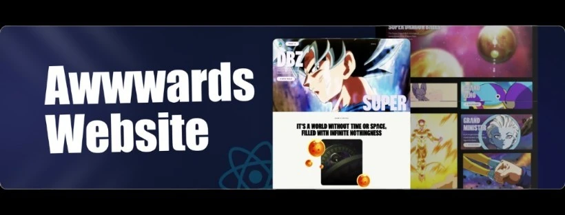

<div align="center">
  <br />
    <a href="https://youtu.be/zA9r5zTllx4" target="_blank">
      
    </a>
  <br />

  <div>
    
    
    
  </div>

  <h3 align="center">An Awwwards Winning Website</h3>

   <div align="center">
     Build this project by <a href="https://www.linkedin.com/in/naman-doshi-007/" target="_blank"><b>Naman</b></a>.
    </div>
</div>

## 📋 <a name="table">Table of Contents</a>

1. 🤖 [Introduction](#introduction)
2. ⚙️ [Tech Stack](#tech-stack)
3. 🔋 [Features](#features)
4. 🤸 [Quick Start](#quick-start)
5. 📜 [License](#license)
6. 🚀 [Contact](#contact)

## ⚠️ Disclaimer

All design credits go to **[Zentry](https://zentry.com/)**.

## <a name="introduction">🤖 Introduction</a>

Build a visually captivating website inspired by **[Zentry](https://zentry.com/)**, featuring scroll-triggered animations, geometric transitions, and engaging video storytelling. Learn how to deliver a luxurious, modern feel, focusing on engaging UI/UX and smooth responsiveness, capturing the essence of what makes an Awwwards winner.

## <a name="tech-stack">⚙️ Tech Stack</a>

- GSAP
- React.js
- Tailwind CSS

## <a name="features">🔋 Features</a>

👉 **Scroll-Based Animations**: Dynamic animations triggered by scrolling for a more engaging user experience.

👉 **Clip Path Shaped Animations**: Unique geometric transitions using CSS clip-paths to create visually stunning effects.

👉 **3D Hover Effects**: Interactive 3D transformations that respond to user interactions for a modern feel.

👉 **Video Transitions**: Seamlessly integrated video elements to enhance storytelling and flow.

👉 **Smooth UI/UX**: Polished interfaces with buttery-smooth interactions for an intuitive user journey.

👉 **Completely Responsive**: Flawless adaptation across all devices, ensuring a consistent experience.

and many more, including code architecture and reusability

## <a name="quick-start">🤸 Quick Start</a>

Follow these steps to set up the project locally on your machine.

**Prerequisites**

Make sure you have the following installed on your machine:

- [Git](https://git-scm.com/)
- [Node.js](https://nodejs.org/en)
- [npm](https://www.npmjs.com/) (Node Package Manager)

**Cloning the Repository**

```bash
git clone https://github.com/DoshiNaman/award-winning-website.git
cd award-winning-website
```

**Installation**

Install the project dependencies using npm:

```bash
npm install
```

**Running the Project**

```bash
npm run dev
```

Open [http://localhost:5173](http://localhost:5173) in your browser to view the project.

## <a name="license">📜 License</a>

This project is licensed under the MIT License. See the [LICENSE](LICENSE) file for more details.

## <a name="contact">🚀 Contact</a>

- **Name:** Naman Doshi
- **Email:** [naman.01798@gmail.com](mailto:naman.01798@gmail.com)
- **GitHub:** [DoshiNaman](https://github.com/DoshiNaman)
- **LinkedIn:** [Naman Doshi](https://www.linkedin.com/in/naman-doshi-007/)

Thank you for visiting!
